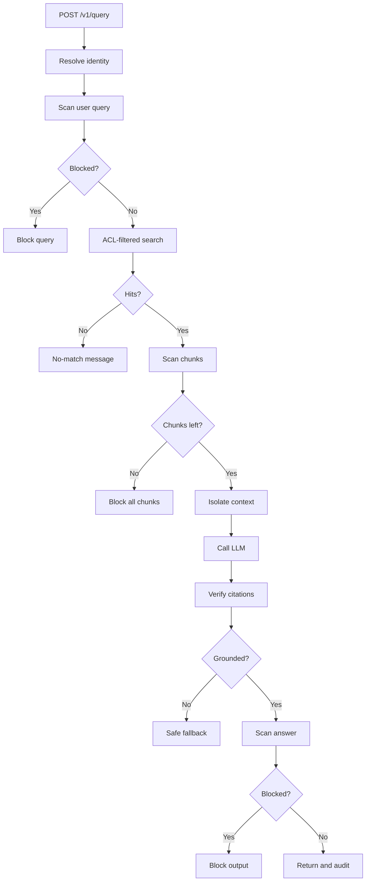

<p align="center">
  <a href="https://github.com/marifort">
    
  </a>
</p>

# Marifort Gate (Community Edition)

ACL gateway for RAG — document-level ACL, semantic DLP, indirect prompt-injection shielding, and citation auditing.

This repository is the **Community Edition (CE)** — MIT. It **builds, tests, and deploys without any Enterprise checkout**. Factual answers come from **ingested documents**, not hardcoded config.

Enterprise Edition (connectors, pgvector, premium operator UX) is a **separate commercial package**. See [ENTERPRISE.md](ENTERPRISE.md).

## Query flow

Every `POST /v1/query` (Query Lab and API) runs this ordered CE pipeline. The LLM is skipped when the question is blocked, ACL retrieval is empty, or every chunk fails the scan. Optional CE controls (canary docs, extraction monitor) hook after retrieval — see the [feature cards](docs/ce/features/).



Depth: [security](docs/ce/security/README.md) · System view: [architecture](docs/shared/architecture.md) · Feature card: [#1 ACL + pipeline](docs/ce/features/01-acl-pipeline.md)

## Documentation

| Document | Contents |
|----------|----------|
| [docs/README.md](docs/README.md) | Documentation map |
| [docs/INDEX.md](docs/INDEX.md) | Feature `#1–#31` spine (CE pages here; EE rows → ENTERPRISE.md) |
| [docs/ce/README.md](docs/ce/README.md) | CE features, tutorials, demos, security, guides |
| [docs/ce/guide/LOCAL_SETUP.md](docs/ce/guide/LOCAL_SETUP.md) | Local Python venv (version, libraries, activate, verify) |
| [docs/shared/architecture.md](docs/shared/architecture.md) | System architecture |
| [docs/ce/guide/ADMIN_GUIDE.md](docs/ce/guide/ADMIN_GUIDE.md) | Operator / admin |
| [docs/ce/guide/DEVELOPER_GUIDE.md](docs/ce/guide/DEVELOPER_GUIDE.md) | Develop and test |
| [docs/product/CLIENT_USAGE.md](docs/product/CLIENT_USAGE.md) | How clients use RAG + MCP (API, Python, UI) |
| [docs/product/CE_EE_BUILD_RUN_DEBUG.md](docs/product/CE_EE_BUILD_RUN_DEBUG.md) | Build, run, debug |
| [ENTERPRISE.md](ENTERPRISE.md) | Community vs Enterprise |

## Quick start (Docker)

**Default path:** Docker Desktop **4.40+** with [Docker Model Runner](https://docs.docker.com/ai/model-runner/) enabled. No private GitHub repo and no `rag-protection-enterprise/` directory are required.

Host tests and `bash tools/build_ce.sh` run **on the machine**, not inside Compose: you need **Git**, **Node.js 20+** (npm), and **Python 3.11+** (3.13 preferred) before the `.env` copy. Docker Desktop is separate (GUI + Model Runner).

### 1. Install software

| Tool | Version | Used for |
|------|---------|----------|
| Git | any recent | Clone |
| Node.js + npm | **20+** (CI uses 20) | React console (`tools/build_ce.sh`) |
| Python | **3.11+** (CI / image: **3.13**) | `.venv`, pytest, `python3 -m json.tool` |
| Docker Desktop | **4.40+** | Compose + Model Runner |

**macOS (Homebrew):**

```bash
brew install git node python@3.13
brew install --cask docker
open -a Docker
```

In Docker Desktop: **Settings → AI → Enable Docker Model Runner**. If `python3 --version` is still 3.9, use `PYTHON=python3.13` with the bootstrap below.

**Ubuntu / Debian / Windows WSL2:**

```bash
sudo apt-get update
sudo apt-get install -y git python3 python3-venv python3-pip curl ca-certificates gnupg
sudo mkdir -p /etc/apt/keyrings
curl -fsSL https://deb.nodesource.com/gpgkey/nodesource-repo.gpg.key \
  | sudo gpg --dearmor -o /etc/apt/keyrings/nodesource.gpg
echo "deb [signed-by=/etc/apt/keyrings/nodesource.gpg] https://deb.nodesource.com/node_20.x nodistro main" \
  | sudo tee /etc/apt/sources.list.d/nodesource.list
sudo apt-get update
sudo apt-get install -y nodejs
```

Install [Docker Desktop](https://docs.docker.com/desktop/) (Model Runner) or [Docker Engine](https://docs.docker.com/engine/install/) (`compose.ci.yml` only — see below). Native Windows `cmd` is not supported.

Confirm:

```bash
git --version
node -v          # v20 or newer
npm -v
python3 --version   # 3.11+
docker --version
```

From a clone, the same host packages (not Docker) can be installed with `bash tools/ce/install_host_deps.sh --apply`. Dry-run (print commands only): omit `--apply`.

### 2. Clone and configure

```bash
git clone https://github.com/marifort/rag-protection.git
cd rag-protection
bash tools/ce/bootstrap.sh
```

`bootstrap.sh` copies `.env.example` → `.env` when `.env` is missing, creates repo-root `.venv`, and builds the React console (`npm ci` + `npm run build`). Equivalent:

```bash
cp -n .env.example .env
PYTHON=python3.13 bash tools/setup_venv.sh   # or python3 if it is already 3.11+
source .venv/bin/activate
bash tools/build_ce.sh --ci
```

`--check` only verifies Git / Node / Python. `--skip-venv` or `--skip-console` skip those steps. Depth: [docs/ce/guide/LOCAL_SETUP.md](docs/ce/guide/LOCAL_SETUP.md).

### 3. Start the stack

```bash
bash tools/docker_start.sh --smoke
curl -sf http://localhost:8090/health | python3 -m json.tool
open http://localhost:8090/ui
```

Answers come from the **LLM plus ingested documents**. `GET /health` → `"status": "healthy"` and `"enterprise_installed": false` means the proxy is up — it does **not** mean the model is warm. The first `POST /v1/query` (and `--smoke`) can take a minute while `ai/gemma3-qat` pulls or starts.

If compose fails with `'models' support requires Docker Model plugin`, Model Runner is off or you are not on Docker Desktop.

### No Docker Desktop (Linux Engine, Colima, CI)

Install host packages and run `bash tools/ce/bootstrap.sh` first (`.env`, venv, console). `compose.yml` cannot start without the Model plugin. Use `compose.ci.yml` and point at an **OpenAI-compatible** chat API in `.env`. From inside the container, `localhost` is the proxy — use `host.docker.internal` for an LLM on the host, or a public HTTPS URL for a hosted API.

```bash
# bootstrap.sh already copied .env; edit it:
# Edit .env, for example:
#   RAG_LLM_BASE_URL=http://host.docker.internal:11434/v1
#   RAG_LLM_MODEL=llama3
#   RAG_LLM_API_KEY=not-needed
docker compose -f compose.ci.yml up -d --build --wait
```

Without an LLM URL, that file still starts the gateway (ACL and `/health` work); answers fall back to “temporarily unavailable.” Stop with `docker compose -f compose.ci.yml down` (`tools/docker_stop.sh` targets `compose.yml`). Host Python without Compose: [docs/ce/guide/LOCAL_SETUP.md](docs/ce/guide/LOCAL_SETUP.md).

Stop:

```bash
bash tools/docker_stop.sh                 # keep data volume
bash tools/docker_stop.sh --mcp-tools     # if you started Layer 2
bash tools/docker_stop.sh --volumes       # reset corpus
```

### Optional CE sidecars

| Flag | What it starts |
|------|----------------|
| `--mcp-tools` | Layer 2 MCP filesystem (`compose.mcp-tools.yml`) |
| `--qdrant` | Qdrant for `RAG_STORE_BACKEND=vector` or `hybrid` |
| `--pinecone` | Pinecone Local for Pattern C examples only |
| `--smoke` | Run `tools/smoke_rag_proxy.sh` after `/health` |

`--ee` needs the **commercial** Enterprise package and checkout. It is not part of this repository.

## Local Python (no Docker)

**Full walkthrough (versions, libraries, verify, troubleshooting):** [docs/ce/guide/LOCAL_SETUP.md](docs/ce/guide/LOCAL_SETUP.md).

**Python:** 3.11 or newer (`requires-python = ">=3.11"`). **CI and the CE Docker image use 3.13** — prefer 3.13 locally so wheels match CI. Newer 3.x is accepted if `python3 --version` is 3.11+. Install Python (and Node, if you will rebuild the console) with [Quick start §1](#1-install-software) or `bash tools/ce/install_host_deps.sh --apply`. `tools/setup_venv.sh` uses `${PYTHON:-python3}` and refuses anything older than 3.11. `bash tools/ce/bootstrap.sh` runs that installer plus the console build.

From the repository root (a standalone CE checkout — not a venv that already has Enterprise installed):

```bash
python3 --version          # expect 3.11+
bash tools/setup_venv.sh   # creates .venv, installs deps, pip install -e rag-protection-proxy
source .venv/bin/activate
which python               # must be ./.venv/bin/python
bash tools/run_tests.sh -q -m "not live"
```

`setup_venv.sh` is the supported installer. It creates gitignored repo-root `.venv` and installs:

| File | What it is |
|------|------------|
| [`rag-protection-proxy/requirements.txt`](rag-protection-proxy/requirements.txt) | Runtime: FastAPI, Uvicorn, httpx, PyYAML, Pydantic, PyJWT, prometheus-client, qdrant-client, sentence-transformers |
| [`rag-protection-proxy/requirements-dev.txt`](rag-protection-proxy/requirements-dev.txt) | pytest, pytest-asyncio, plus examples via `-r` |
| [`examples/requirements.txt`](examples/requirements.txt) | LangChain / Pinecone samples (`langchain-core`, `pinecone`) — not used by the proxy pipeline |

First run can take several minutes (PyTorch via `sentence-transformers`). Do **not** `pip install rag-protection-enterprise`.

Pin a newer interpreter (only applies when `.venv` does not exist yet):

```bash
rm -rf .venv
PYTHON=python3.13 bash tools/setup_venv.sh
```

Run the API on the host (config paths are relative — `cd` into the package):

```bash
cd rag-protection-proxy
export RAG_LLM_BASE_URL=http://localhost:12434/engines/v1
python -m rag_protection_proxy
```

Cursor / VS Code: **Python: Select Interpreter** → `./.venv/bin/python`, then open a **new** terminal (this repo’s **zsh (.venv)** profile sources `.venv`). Already-open tabs stay unchanged unless you `source .venv/bin/activate`.

## Helm (baseline chart)

```bash
helm template rag-protection deploy/helm/rag-protection
```

Use the chart defaults (`values.yaml`). Do not require `values-ee-local.yaml` — that overlay is an optional Enterprise seam.

## Layout

```text
rag-protection-proxy/     CE Python package + CE Dockerfiles
console/                  CE React console (packages/core + packages/ce)
docs/ce/ · docs/shared/   CE product documentation
examples/                 LangChain / Python / MCP samples
deploy/helm/              Baseline Helm chart
deploy/siem/              SIEM pack (#5)
tools/ce/bootstrap.sh     .env + venv + console
tools/build_ce.sh         Console build
tools/docker_start.sh     Compose stack (CE default)
compose.yml               CE stack (Docker Model Runner)
compose.ci.yml            No Model Runner — GitHub Actions and BYO LLM
```

## Related

[SOC Governance](https://github.com/sergueifedotov/soc-governance) governs AI *actions* (MCP tool-call
policy, human-gated SIEM response, forensics). The MCP tool-call gateway is also at
[mcp-security-proxy](https://github.com/sergueifedotov/mcp-security-proxy). This repository governs AI
*retrieval*.

## License

**Marifort Gate** Community Edition — [MIT](LICENSE) — Copyright (c) 2026 **Marifort Systems Inc.**  
Enterprise Edition is a separate proprietary package — see [ENTERPRISE.md](ENTERPRISE.md).
