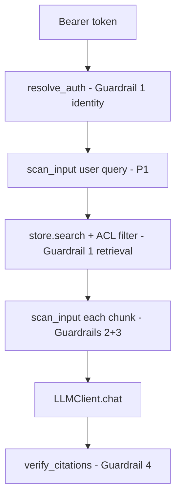

# Guardrail 1 — Document-Level ACL Enforcement

This document explains how the RAG Protection Proxy enforces **document-level access control** before retrieval: users only see chunks from documents whose `allowed_groups` intersect their identity groups. Unauthorized documents never enter the candidate set.

**Index:** [guardrails/README.md](README.md) · **Related:** [RAG_Protection.md § 1](../README.md#1-document-level-acl-enforcement-context-filtering) · [ARCHITECTURE.md § Guardrail 1 demo](../README.md#guardrail-1--document-acl-pre-retrieval) · [KNOWLEDGE_BASE.md](../README.md)

---

## Quick answers

| Question | Answer |
|----------|--------|
| What does document ACL do? | Filters documents by **metadata groups** before search scoring — unauthorized content is never retrieved. |
| Does ACL detect malicious content? | **No** — ACL checks **authorization** (group membership), not text patterns. See [How unauthorized content is filtered](#how-unauthorized-content-is-filtered) |
| When does ACL run? | **Pre-retrieval** — inside `DocumentStore.search()` (SQLite) or as a Qdrant metadata filter (vector backend). Also on `GET /v1/documents`. |
| How is the user identified? | `Authorization: Bearer …` → `resolve_auth()` → `AuthContext` with `subject` and `groups`. |
| What if nothing matches ACL + query? | Static answer: *"No authorized documents matched your question…"* — **no LLM call**. |
| Demo tokens? | `employee-demo-token`, `hr-demo-token`, `exec-demo-token` in `config/acl_policy.yaml`. |
| Production identity? | HS256 JWT (`jwt_secret`) or OIDC JWKS (`oidc.enabled`) — see [V1_P0_FEATURES.md](../README.md). |

---

## The threat

In enterprise RAG, the vector store or document index often spans HR portals, executive memos, engineering runbooks, and public FAQs. Without a **pre-retrieval filter**, semantic search can surface payroll totals, acquisition plans, or confidential runbooks to users who lack permission — even if the LLM would otherwise behave safely.

```text
Engineer asks: "What is the Q1 payroll total?"

Without ACL → hr-payroll chunk retrieved → $4.2M disclosed
With ACL    → hr-payroll excluded at search → no payroll data in prompt
```

ACL is the **first guardrail** in the pipeline. Later guardrails (DLP, injection, citation) only see text the user was already authorized to retrieve.

---

## How unauthorized content is filtered

Guardrail 1 does **not** scan document text for malicious or sensitive patterns. It enforces **document-level access control** based on metadata:

```text
document.allowed_groups  ∩  user.groups (with hierarchy)  ≠ ∅  →  document searchable
else                                                         →  document invisible to this user
```

### What ACL checks

| Input | Source | Example |
|-------|--------|---------|
| User identity | Bearer token → `resolve_auth()` | `hr-demo-token` → groups `["hr"]` |
| Document groups | Ingest metadata / sample corpus | `hr-payroll` → `allowed_groups: ["hr", "executives"]` |
| Group inheritance | `acl_policy.yaml` → `group_hierarchy` | `executives` may inherit `hr` access |

### What ACL does *not* check

- Prompt injection, PII, secrets, or URL patterns in document body
- Whether retrieved text is truthful or grounded
- Whether the user's **query** is a jailbreak (that is P1 user-query guardrails)

A poisoned document ingested into `all-staff` is **authorized for everyone** at the ACL layer — injection/DLP scanners on chunks and ingest must catch it separately.

### Module responsibilities

| Module | Role |
|--------|------|
| `acl.py` | `resolve_auth()`, `user_can_access_document()`, group expansion |
| `store.py` / `vector_store.py` | Skip documents failing ACL during `search()` |
| `config/acl_policy.yaml` | Demo tokens, JWT/OIDC, group hierarchy |

Detection overview (all guardrails): [DETECTION_OVERVIEW.md](DETECTION_OVERVIEW.md).

---

## Pipeline placement

Identity and ACL run **before** chunk-level guardrails and **before** the LLM. v1 P1 adds a user-query scan immediately after auth (see [P1_USER_QUERY_GUARDRAILS.md](P1_USER_QUERY_GUARDRAILS.md)).



```text
Authorization: Bearer <token>
       │
       ▼
resolve_auth()                  ← Guardrail 1 (identity)
       │
       ▼
scan_input(user_query)          ← P1 (Guardrails 2+3 on query text)
       │
       ▼
store.search(query, user_groups)
  └─ user_can_access_document() ← Guardrail 1 (per document)
       │
       ▼
for each authorized chunk:
  scan_input()                  ← Guardrails 2 + 3
       │
       ▼
LLMClient.chat()
       │
       ▼
verify_citations()              ← Guardrail 4
```

**Key modules:**

| Module | Role |
|--------|------|
| `acl.py` | `resolve_auth()`, `user_can_access_document()`, group hierarchy |
| `config/acl_policy.yaml` | Demo tokens, JWT/OIDC settings, group inheritance |
| `store.py` | SQLite search skips unauthorized documents before scoring |
| `vector_store.py` | Qdrant search with `build_acl_filter()` metadata predicate |
| `app.py` | Auth on `/v1/query`, ACL-filtered `/v1/documents` |

---

## Identity resolution (`resolve_auth`)

The proxy resolves the caller's groups from the bearer token, in order:

| Method | Config | `auth_method` |
|--------|--------|---------------|
| **Demo token** | Exact match in `acl_policy.yaml` → `demo_users` | `demo_token` |
| **OIDC JWT** | `oidc.enabled` + JWKS verify (`issuer`, `audience`, `groups_claim`) | `oidc` |
| **HS256 JWT** | `jwt_secret` set; groups from `jwt_groups_claim` (default `groups`) or `roles` | `jwt` |

Missing or invalid auth → **401 Unauthorized** on protected endpoints.

### Demo users (local testing)

| Token | Subject | Groups (expanded) | Typical access |
|-------|---------|-------------------|----------------|
| `employee-demo-token` | alice.engineer | engineering, all-staff | FAQ, runbook, poisoned ticket |
| `hr-demo-token` | bob.hr | hr, all-staff | FAQ + HR payroll |
| `exec-demo-token` | carol.exec | executives, all-staff | FAQ + HR + executive strategy |

### Group hierarchy

`group_hierarchy` in `acl_policy.yaml` expands inherited groups at auth time:

```yaml
group_hierarchy:
  executives:
    - all-staff
  hr:
    - all-staff
  engineering:
    - all-staff
```

An `hr` user receives both `hr` and `all-staff` in `AuthContext.groups`.

---

## Access check (`user_can_access_document`)

A user may read a document when:

```python
set(user_groups) & set(document_allowed_groups)  # non-empty intersection
```

**Or** the document is tagged with a universal group:

| Document tag | Effect |
|--------------|--------|
| `public` | Any authenticated user can access |
| `all-staff` | Any user whose expanded groups include `all-staff` |

Documents with **empty** `allowed_groups` are **denied** to everyone.

### Sample corpus ACL tags

| Document | `allowed_groups` | Who can retrieve |
|----------|------------------|------------------|
| `public-faq` | `all-staff`, `public` | All demo tokens |
| `eng-runbook` | `engineering` | Engineer token only |
| `hr-payroll` | `hr`, `executives` | HR and exec tokens |
| `exec-strategy` | `executives` | Exec token only |
| `customer-feedback-poisoned` | `all-staff`, `public` | All demo tokens |

---

## Enforcement points

### 1. Retrieval (`store.search`)

SQLite backend loads all chunks, then **skips** rows where `user_can_access_document` fails **before** lexical scoring:

```python
if not user_can_access_document(user_groups, allowed_groups):
    continue
```

Unauthorized documents never receive a relevance score and cannot appear in `top_k` results.

### 2. Vector retrieval (`VectorDocumentStore.search`)

With `RAG_STORE_BACKEND=vector`, ACL is pushed into the Qdrant query as a metadata filter (`build_acl_filter`). The database returns only points whose `allowed_groups` intersect the user's groups (plus `public` / `all-staff`). This matches the production pattern: **filter at the store**, not in application code after search.

### 3. Document list (`GET /v1/documents`)

The list endpoint returns only documents the caller can access — same `user_can_access_document` check. Useful for operator UI and verifying ACL without running a query.

### 4. Ingest (`POST /v1/ingest`)

Admin ingest accepts `allowed_groups` per document. ACL tags are stored with the document and enforced on every subsequent query. Ingest does **not** validate that the admin's groups match the tags (admin key is separate from user ACL).

### 5. Connector ingest (Drive, Notion — E2.2, E2.7)

Source permissions are mapped to `allowed_groups` at connector ingest. When mapping fails, default policy is **fail-closed** (`allowed_groups: []`) — see [E2_7_ACL_MAPPING_FAIL_CLOSED.md](../../../ENTERPRISE.md).

| Mapping outcome | `allowed_groups` | Retrieval |
|-----------------|------------------|-----------|
| Permissions map to groups | e.g. `["hr"]` | Normal ACL |
| No permissions map (default) | `[]` | Denied to all users |
| Legacy  |  | Wide access — still flagged  |

Operators detect failures via ingest response fields, document metadata, audit `acl_mapping_failed`, and `GET /admin/connectors/acl-mapping/issues`.

---

## Empty retrieval behavior

When `store.search()` returns no ACL-authorized chunks (wrong groups, no keyword match, or empty index):

```text
answer: "No authorized documents matched your question in the knowledge base."
chunks: []
LLM: not called
```

This is distinct from `all_chunks_blocked` (Guardrails 2/3 blocked every retrieved chunk).

---

## Configuration

Primary file: `config/acl_policy.yaml` (override path via `RAG_ACL_FILE`).

| Key | Purpose |
|-----|---------|
| `default_groups` | Groups assigned when token payload has no groups claim |
| `group_hierarchy` | Parent group → inherited groups |
| `demo_users` | Local bearer tokens for demos |
| `jwt_secret` / `jwt_algorithms` / `jwt_groups_claim` | HS256 corporate JWT |
| `oidc.*` | Corporate IdP (Okta, Azure AD) — JWKS, issuer, audience |

Reload ACL without restart: `POST /admin/reload-policy` (reloads both policy and ACL YAML).

View effective config (secrets redacted): `GET /admin/policy-config` with admin API key.

---

## Demo scenarios

### Payroll — engineer blocked, HR allowed

```bash
# Engineer — must NOT see hr-payroll
curl -s http://localhost:8090/v1/query \
  -H "Authorization: Bearer employee-demo-token" \
  -H "Content-Type: application/json" \
  -d '{"query":"What is the Q1 payroll total?","top_k":4}' | python3 -m json.tool

# HR — hr-payroll retrieved
curl -s http://localhost:8090/v1/query \
  -H "Authorization: Bearer hr-demo-token" \
  -H "Content-Type: application/json" \
  -d '{"query":"What is the Q1 payroll total?","top_k":4}' | python3 -m json.tool
```

**Expected:** Engineer response has no `$4.2M` from `hr-payroll`; HR response includes `hr-payroll` in `chunks[]`.

### Executive strategy — engineer blocked, exec allowed

```bash
curl -s http://localhost:8090/v1/query \
  -H "Authorization: Bearer employee-demo-token" \
  -H "Content-Type: application/json" \
  -d '{"query":"What is the Q3 acquisition plan?","top_k":4}' | python3 -m json.tool

curl -s http://localhost:8090/v1/query \
  -H "Authorization: Bearer exec-demo-token" \
  -H "Content-Type: application/json" \
  -d '{"query":"What is the Q3 acquisition plan?","top_k":4}' | python3 -m json.tool
```

**Expected:** Engineer gets no `exec-strategy` chunk; exec may retrieve the `$18M` acquisition memo.

### ACL-filtered document list

```bash
curl -s http://localhost:8090/v1/documents \
  -H "Authorization: Bearer employee-demo-token" | python3 -m json.tool
```

**Expected:** List excludes `hr-payroll` and `exec-strategy`.

Full walkthrough: [ARCHITECTURE.md § Guardrail Demo Walkthrough](../README.md#guardrail-demo-walkthrough).

---

## UI walkthrough

**Detailed test cases (label A):** [test-plans/GUARDRAIL_TEST_PLAN.md § A](../../../ENTERPRISE.md#a--document-acl) (TC-GR-A-001–006).

Open `http://localhost:8090/ui` after starting the stack.

| Step | UI action | What to observe |
|------|-----------|-----------------|
| 1 | Toolbar → set **User bearer token** to `employee-demo-token` | Token drives ACL for all user endpoints |
| 2 | **Query Lab** → click **Payroll sample** → **Run Query** | Answer: no authorized documents; `chunks: []` — payroll never retrieved |
| 3 | Change preset to **hr-demo-token** → **Run Query** again | `chunks` includes `hr-payroll`; LLM may summarize `$4.2M` |
| 4 | **Documents & Ingest** → corpus table | Engineer list excludes `hr-payroll` and `exec-strategy` |
| 5 | **Audit Log** | No `scan_input` on chunks when engineer payroll query returns empty retrieval |

The **Query Lab** demo presets map to `acl_policy.yaml` demo users (including Acme/Globex people). ACL is enforced server-side — the UI only selects the bearer token. Toolbar **Operator tenant** is a different list (stores on disk); see [USER_GUIDE §14](../guide/USER_GUIDE.md#query-lab-presets-vs-operator-tenant).

---

## Tests

| Test | File | What it checks |
|------|------|----------------|
| `test_acl_demo_token_resolves` | `tests/test_rag_protection.py` | Demo token → subject + groups |
| `test_document_acl_blocks_hr_doc_for_engineer` | `tests/test_rag_protection.py` | Group intersection logic |
| `test_store_acl_filtered_search` | `tests/test_rag_protection.py` | SQLite search excludes HR doc for engineer |
| `test_build_acl_filter_includes_public_and_all_staff` | `tests/test_vector_store.py` | Vector metadata filter shape |
| `test_vector_store_acl_filtered_search` | `tests/test_vector_store.py` | Engineer never gets payroll from Qdrant |
| `test_oidc_jwt_resolves_groups` | `tests/test_oidc_auth.py` | OIDC JWT → groups |
| `test_documents_list_is_acl_filtered` | `tests/test_ui_and_admin.py` | `/v1/documents` respects ACL |
| `test_engineer_payroll_acl_sqlite` / `_vector` | `tests/integration/test_vector_pipeline.py` | ACL parity across backends |
| `test_live_engineer_payroll_no_hr_chunks` | `tests/integration/test_live_stack.py` | Live stack ACL smoke |

Run:

```bash
cd rag-protection-proxy
pytest -q tests/test_rag_protection.py -k acl
pytest -q tests/integration/test_vector_pipeline.py -k payroll_acl
```

---

## MVP scope and gaps

| Shipped | Not yet implemented |
|---------|---------------------|
| Pre-retrieval ACL on `allowed_groups` (SQLite + Qdrant) | Permission sync from source systems (Drive, Notion, Jira) |
| Demo bearer tokens + optional HS256 JWT | Full OAuth login flows in UI |
| OIDC JWKS validation (v1 P0) | Automatic group mapping from IdP app roles |
| Group hierarchy expansion | Document-level ACL beyond group tags (user-specific grants) |
| ACL on search and document list | Row/column-level security inside documents |
| Ingest accepts `allowed_groups` per document (v1 P1) | Source-system ACL propagation at ingest |

**Enterprise next:** connectors that propagate source-system ACL into `allowed_groups` at ingest. See [IMPLEMENTATION_STATUS.md](../README.md) and [NEXT_STEPS.md](../README.md).

---

## Related documentation

| Topic | Document |
|-------|----------|
| Guardrails index | [README.md](README.md) |
| All four guardrails (overview) | [ARCHITECTURE.md § Four Core Security Guardrails](../README.md#four-core-security-guardrails) |
| DLP on authorized chunks | [GUARDRAIL_2_DLP.md](GUARDRAIL_2_DLP.md) |
| Vector ACL metadata filter | [RETRIEVAL_AND_VECTOR_DB.md](../README.md) |
| OIDC / IdP setup | [V1_P0_FEATURES.md](../README.md) |
| Sample document ACL tags | [KNOWLEDGE_BASE.md](../README.md) |
