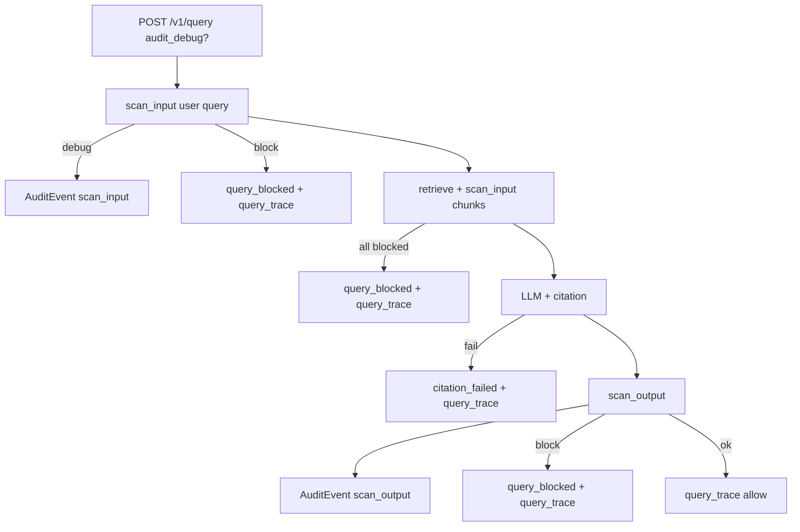

# P2 — Audit Debug Forensics

**Status:** Shipped · **Modules:** `audit.py`, `pipeline.py`, `guardrails/input_pipeline.py`, `guardrails/output_pipeline.py`, `models.py`, `ui/static/index.html`

**Parent:** [P2_PERSISTENT_AUDIT.md](P2_PERSISTENT_AUDIT.md) · **Operator:** [tutorial/02 §7.3](../tutorials/02-operator-console-ingest-and-audit.md#73-audit-debug-forensics-operator-tuning) · [ADMIN_GUIDE.md §9](../../ce/guide/ADMIN_GUIDE.md#audit-debug-forensics)

---

## Problem

Default audit events include a short **`detail`** string (e.g. `sanitized + warning: employee_id`) and structured **`findings[]`** (scanner, category, masked snippet). That is enough for compliance trends and SIEM rules, but operators tuning DLP or investigating a block often need to answer:

- What text was scanned **after** redaction?
- What query/chunk context reached the LLM?
- What changed on the output path?

**Audit debug forensics** adds optional, **sanitized, truncated previews** — not raw secrets or full corpus copies.

---

## Design principles

| Principle | Implementation |
|-----------|----------------|
| **Opt-in** | Off by default (`audit.debug_mode: false`); per-query `audit_debug: true` for repros |
| **Sanitized only** | Previews use post-`scan_input` / post-`scan_output` text; secrets stay `[redacted:…]` |
| **Truncated** | `audit.debug_max_preview_chars` (default 500); overflow marked with `…` |
| **Shorter TTL for previews** | `audit.debug_retention_hours` strips `debug` block; compliance row kept |
| **Lean SIEM** | Webhook omits `debug` unless `audit.debug_webhook: true` |
| **Scrub on export** | `audit.scrub_export: true` applies SSN/SIN/email/phone patterns to previews |

**Do not** enable raw input/output in default audit — that creates a second sensitive datastore and conflicts with E4.3 scrub policy.

---

## Schema

Optional block on `AuditEvent` (`models.py`):

```python
class AuditDebugPreview(BaseModel):
    query_preview: Optional[str] = None    # sanitized user query
    input_preview: Optional[str] = None      # post-scan text (query/chunk/ingest)
    output_preview: Optional[str] = None     # post-scan LLM answer
    redactions: Optional[int] = None
    chunk_ids: List[str] = []

class AuditEvent(BaseModel):
    ...
    detail: Optional[str] = None             # short summary (unchanged)
    findings: List[Finding] = []             # structured scanner results
    debug: Optional[AuditDebugPreview] = None
```

**`detail` vs `debug`:**

| Field | Purpose | Example |
|-------|---------|---------|
| `detail` | One-line operator/SIEM summary | `sanitized + warning: employee_id` |
| `findings[]` | Structured hits | `category: employee_id`, masked snippet |
| `debug` | Forensic sanitized text | `input_preview: "Badge [REDACTED_EMP_ID]"` |

---

## Activation

Debug previews attach when **either**:

1. **Global:** `audit.debug_mode: true` in `config/policy.yaml` (short tuning windows only), **or**
2. **Per request:**
   - `POST /v1/query` with `"audit_debug": true` (Query Lab checkbox **audit_debug**)
   - `POST /v1/ingest` with `"audit_debug": true` (Documents & Ingest checkbox **audit_debug**)

Helper: `audit_debug_active(policy, request_flag=…)` in `audit.py`.

Per-request flag propagates to chunk scans and output scan via `InputScanRequest.context` / `OutputScanRequest.context`. On ingest, `scan_ingest_content(..., audit_debug=…)` sets the same context for the title+content `scan_input`.

**Ingest path:** per-ingest `audit_debug` on `DocumentIngestRequest` / Documents & Ingest UI, or global `audit.debug_mode`.
---

## Pipeline hooks



| `kind` | When | `debug` fields |
|--------|------|----------------|
| `scan_input` | Every input scan when debug active | `input_preview`, `redactions` |
| `scan_output` | LLM answer scan when debug active | `output_preview`, `redactions` |
| `query_trace` | End of query pipeline (success or terminal block) | `query_preview`, `output_preview`, `chunk_ids[]`, **`citation_claims[]`** + `citation_coverage_ratio` when citation ran |
| `query_blocked` | Query/chunk/output block when debug active | `query_preview`, optional `output_preview`, `chunk_ids[]` |
| `citation_failed` | Citation check fails when debug active | `query_preview`, `output_preview` (raw answer scrubbed), `chunk_ids[]`, **`citation_claims[]`** (incl. `entailment_score`), `citation_coverage_ratio` |

---

## Policy configuration

```yaml
# config/policy.yaml
audit:
  retention_days: 7
  backup_keep_days: 7
  scrub_export: true
  max_export_rows: 5000
  debug_mode: false                 # global forensics (default off)
  debug_max_preview_chars: 500
  debug_retention_hours: 24         # strip debug block after 24h; 0 = keep until event TTL
  debug_webhook: false              # omit debug from SIEM POSTs (default)
```

| Key | Default | Description |
|-----|---------|-------------|
| `audit.debug_mode` | `false` | Attach previews on scans + query pipeline |
| `audit.debug_max_preview_chars` | `500` | Max chars per preview field |
| `audit.debug_retention_hours` | `24` | Remove `debug` from events older than N hours |
| `audit.debug_webhook` | `false` | Include `debug` in webhook JSON when `true` |

**Admin RBAC (E2.4):** `audit_reader` can list/export audit events but **`debug` is stripped** unless the admin also has **`audit_debug_reader`** or **`policy_admin`**. Demo tokens: `rag-audit-reader-key` (no debug) · `rag-audit-debug-key` (with debug).

| Role | `/admin/audit/events` debug | `/admin/audit/export` debug |
|------|---------------------------|-----------------------------|
| `audit_reader` only | Stripped | Stripped |
| `audit_debug_reader` | Included | Included |
| `policy_admin` | Included | Included |
| `RAG_ADMIN_API_KEY` | Included | Included |

Env sync: `_sync_audit_policy()` in `app.py` passes `debug_retention_hours` and `debug_webhook` to `configure_audit_policy()`.

---

## Retention

Two independent clocks:

| Mechanism | Control | Effect |
|-----------|---------|--------|
| **Event TTL** | `audit.retention_days` | Entire event removed (backed up first) |
| **Debug TTL** | `audit.debug_retention_hours` | Only `debug` block stripped; `detail` + `findings` remain |

`strip_expired_debug_previews()` runs inside `apply_retention()` (startup, every 50 `record()` calls, export/stats).

---

## Export, webhook, and scrub

| Sink | `debug` behavior |
|------|------------------|
| **JSONL on disk** | Full `debug` when recorded |
| **`GET /admin/audit/export`** | Scrubbed when `audit.scrub_export: true` |
| **Webhook** | Omitted unless `audit.debug_webhook: true` |
| **Ring buffer / UI** | Full event including `debug` |

Scrub patterns (`audit.py`): SSN, SIN, phone, email — applied to `findings[].snippet`, `detail`, and `debug.*_preview`.

---

## Operator UI

**Query Lab**

- Checkbox **audit_debug** → `POST /v1/query` with `"audit_debug": true`
- With admin token set: after run, console switches to **Audit Log** and opens drawer on latest event

**Documents & Ingest**

- Checkbox **audit_debug** → `POST /v1/ingest` with `"audit_debug": true`
- Toast directs operator to **Audit Log** for the ingest `scan_input` preview

**Audit Log table**

| Column / cue | Meaning |
|--------------|---------|
| **Findings** | Category + label, e.g. `employee_id (INTERNAL)` |
| **debug** pill on Kind | Event has sanitized previews |
| **Detail** | Short summary (unchanged) |
| **Click row** | Drawer: summary, findings table, debug previews |

Empty drawer hint is source-aware: ingest events (`rag:ingest:…` / `ingest_completed`) point at Documents & Ingest **audit_debug**; query events point at Query Lab.
---

## Production posture

| Environment | `debug_mode` | `audit_debug` | `debug_retention_hours` | `debug_webhook` |
|-------------|--------------|---------------|-------------------------|-----------------|
| **Production** | `false` | Only during active incident repro | `24` | `false` |
| **POC / tuning** | `false` (prefer per-query) | `true` on sample queries | `24` | `false` |
| **Dev** | `true` if needed | either | `24` or `0` | `false` |

---

## API examples

**Per-request forensics:**

```bash
curl -s -X POST http://localhost:8090/v1/query \
  -H "Authorization: Bearer employee-demo-token" \
  -H "Content-Type: application/json" \
  -d '{"query":"Badge EMP-123456","top_k":4,"audit_debug":true}' | python3 -m json.tool
```

```bash
curl -s -X POST "http://localhost:8090/v1/ingest?tenant_id=default" \
  -H "Authorization: Bearer rag-admin-demo-key" \
  -H "Content-Type: application/json" \
  -d '{"document_id":"doc-debug-1","title":"Badge note","content":"Badge EMP-123456","allowed_groups":["all-staff"],"audit_debug":true}' | python3 -m json.tool
```

**Inspect events (admin):**

```bash
curl -s "http://localhost:8090/admin/audit/events?limit=10&search=employee_id" \
  -H "Authorization: Bearer rag-admin-demo-key" | python3 -m json.tool
```

**Example NDJSON line:**

```json
{
  "timestamp": 1719000000.0,
  "kind": "scan_input",
  "decision": "challenge",
  "source": "rag:user_query",
  "detail": "sanitized + warning: employee_id",
  "findings": [
    {
      "scanner": "custom_pattern",
      "category": "employee_id",
      "severity": 0.6,
      "label": "INTERNAL",
      "snippet": "EM******56"
    }
  ],
  "debug": {
    "input_preview": "Badge [REDACTED_EMP_ID]",
    "redactions": 1
  }
}
```

**End-to-end trace (`query_trace`):**

```json
{
  "kind": "query_trace",
  "decision": "allow",
  "detail": "query completed",
  "debug": {
    "query_preview": "What is Q1 payroll?",
    "output_preview": "Q1 total was …",
    "chunk_ids": ["hr-payroll-chunk-0"]
  }
}
```

---

## Module reference

| File | Role |
|------|------|
| `rag_protection_proxy/models.py` | `AuditDebugPreview`, `QueryRequest.audit_debug` |
| `rag_protection_proxy/config.py` | `AuditPolicy` debug fields |
| `rag_protection_proxy/audit.py` | `build_audit_debug_preview`, `audit_preview_text`, `strip_expired_debug_previews`, scrub/webhook |
| `rag_protection_proxy/guardrails/input_pipeline.py` | `scan_input` → `debug.input_preview` |
| `rag_protection_proxy/guardrails/output_pipeline.py` | `scan_output` → `debug.output_preview` |
| `rag_protection_proxy/pipeline.py` | `query_trace`, blocked-path debug, per-request context |
| `rag_protection_proxy/ui/static/index.html` | Table cues, drawer, Query Lab checkbox |
| `config/policy.yaml` | Default policy keys |

---

## Tests

**Automated:**

```bash
cd rag-protection-proxy
pytest -q tests/test_audit_debug.py
```

| Test | Verifies |
|------|----------|
| `test_build_audit_debug_preview_*` | Truncation + scrub |
| `test_scrub_event_payload_scrubs_debug_previews` | Export scrub |
| `test_webhook_strips_debug_by_default` | SIEM lean default |
| `test_scan_input_records_debug_for_per_request_flag` | `audit_debug` without global mode |
| `test_strip_expired_debug_previews` | Debug TTL |
| `test_blocked_query_with_audit_debug_records_query_trace` | Blocked query + `audit_debug` → `query_trace` with previews |
| `test_admin_audit_events_strips_debug_for_audit_reader_only` | E2 RBAC — `tests/test_e2.py` |
| `test_admin_audit_export_strips_debug_for_audit_reader_only` | E2 RBAC export — `tests/test_e2.py` |
| `test_scan_input_records_debug_preview_when_debug_mode_enabled` | Global mode |

**Manual UI:**

| ID | Plan | Title |
|----|------|-------|
| TC-E1-205 | [E1_TEST_PLAN](../../../ENTERPRISE.md) | Per-query audit_debug |
| TC-E1-206 | E1_TEST_PLAN | Audit drawer drill-down |
| TC-E1-207 | E1_TEST_PLAN | Findings column + debug pill |
| TC-E1-208 | E1_TEST_PLAN | Drawer without debug role (RBAC) |
| TC-E1-209 | E1_TEST_PLAN | Drawer with audit_debug_reader |
| TC-E1-210 | E1_TEST_PLAN | Blocked query + auto drawer |
| TC-E2-411 | [E2_TEST_PLAN](../../../ENTERPRISE.md) | Events API debug RBAC |
| TC-E2-412 | E2_TEST_PLAN | Export debug RBAC |
| TC-GR-B-002b | [GUARDRAIL_TEST_PLAN](../../../ENTERPRISE.md) | DLP + audit_debug previews |

---

## Related documentation

| Topic | Document |
|-------|----------|
| Persistent audit sinks | [P2_PERSISTENT_AUDIT.md](P2_PERSISTENT_AUDIT.md) |
| Architecture | [ARCHITECTURE.md § Audit](../README.md#audit-auditpy) |
| Tutorial walkthrough | [tutorial/02 §7.3](../tutorials/02-operator-console-ingest-and-audit.md#73-audit-debug-forensics-operator-tuning) |
| Admin operations | [ADMIN_GUIDE.md §9](../../ce/guide/ADMIN_SETTINGS_AND_TESTS.md#9-persistent-audit-p2) |
| Data handling / DPA | [DATA_HANDLING.md](../README.md) |
| Custom DLP patterns | [E6_2_CUSTOM_PATTERNS.md](../../../ENTERPRISE.md) |

---

## Gaps (future)

| Shipped | Not yet |
|---------|---------|
| Opt-in sanitized previews | Separate debug-only JSONL sink |
| Per-query `audit_debug` | Auto-link drawer event to Query Lab run ID |
| Per-ingest `audit_debug` on admin ingest API + Documents & Ingest UI | — |
| **`audit_debug_reader` RBAC** on admin audit API | — |
| Debug TTL on disk | — |
| UI drawer + table cues + RBAC UI tests (TC-E1-208–210) | — |
| Source-aware empty debug hint (ingest vs query) | — |

See [IMPLEMENTATION_STATUS.md](../README.md).
