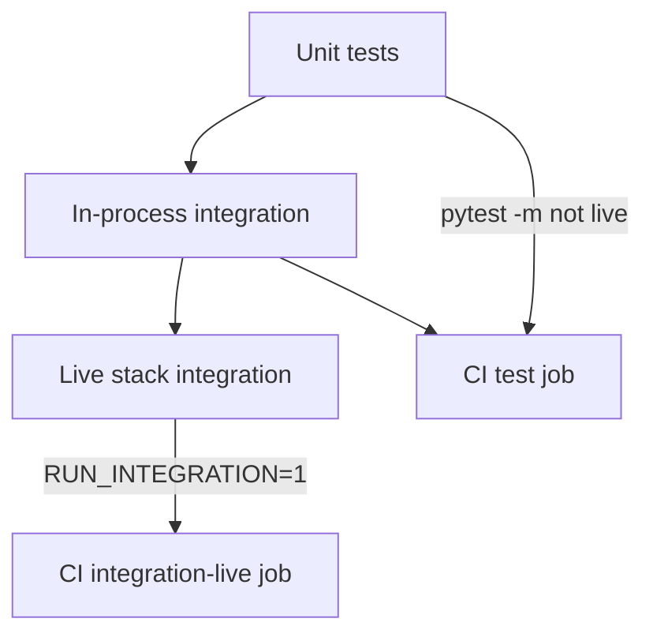

# P2 — Integration Quality Suite

v1 P2 adds pytest tiers that prove **SQLite vs vector backend parity** for ACL, retrieval, and guardrails — plus optional **live-stack smoke** against `docker compose` with Model Runner and Qdrant.

**Status:** Shipped · **CI:** `.github/workflows/ci.yml`

**Index:** [README.md](README.md) · **Related:** [GUARDRAIL_1_ACL.md](GUARDRAIL_1_ACL.md) · [../V1_P0_FEATURES.md](../README.md)

---

## Quick answers

| Question | Answer |
|----------|--------|
| Why integration tests? | Unit tests mock pieces; integration runs full `POST /v1/query` pipeline |
| In-process vs live? | In-process uses `TestClient` + `:memory:` Qdrant; live hits `http://localhost:8090` |
| How to run default CI? | `pytest -m "not live"` (50 tests) |
| Live stack? | `RUN_INTEGRATION=1 pytest -m live` after compose is up (local: `compose.yml`; GitHub: `compose.ci.yml`) |
| What parity is proven? | ACL, FAQ, payroll, poisoned ticket, jailbreak query — same outcomes both backends |

---

## Test tiers



| Tier | Marker | Docker required | Network |
|------|--------|-----------------|---------|
| Unit | (default) | No | No |
| In-process integration | `@pytest.mark.integration` | No | No |
| Live stack | `@pytest.mark.live` | Yes | Yes (localhost:8090) |

---

## Running tests

```bash
cd rag-protection-proxy

# Default CI — unit + in-process integration (50 tests)
pytest -q -m "not live"

# In-process integration only
pytest -q -m "integration and not live"

# Live stack — local (Docker Desktop + Model Runner)
docker compose up -d --build --wait
RUN_INTEGRATION=1 RAG_BASE_URL=http://localhost:8090 pytest -q -m live

# Live stack — GitHub Actions (no Model Runner plugin)
docker compose -f compose.ci.yml up -d --build --wait

# Convenience script from repo root
bash tools/run_tests.sh
```

**CI jobs** (`.github/workflows/ci.yml`):

| Job | Command |
|-----|---------|
| `test-ce-only` | `pytest -m "not live"` then `pytest -m "integration and not live"` |
| `integration-live` | `docker compose -f compose.ci.yml up` → `pytest -m live` |

---

## In-process integration (`test_vector_pipeline.py`)

Fixtures in `tests/integration/conftest.py`:

- `backend_client("sqlite")` — SQLite store
- `backend_client("vector")` — in-memory Qdrant (`RAG_QDRANT_URL=:memory:`)
- `HashEmbedder` for deterministic vector tests

| Test | Guardrail / feature verified |
|------|------------------------------|
| `test_health_reports_sqlite_backend` | Backend selection |
| `test_health_reports_vector_backend` | Vector backend health |
| `test_engineer_payroll_acl_sqlite` | **Guardrail 1** — engineer blocked |
| `test_engineer_payroll_acl_vector` | **Guardrail 1** — same on vector |
| `test_hr_payroll_retrieval_sqlite` | HR payroll retrieval |
| `test_hr_payroll_retrieval_vector` | Parity on vector |
| `test_faq_retrieval_sqlite` | FAQ retrieval |
| `test_faq_retrieval_vector` | Semantic FAQ on vector |
| `test_poisoned_ticket_guardrail_parity` | **Guardrail 3** — no phishing in answer |
| `test_query_guardrail_blocks_before_retrieval_both_backends` | **P1** — jailbreak before retrieval |

---

## Live-stack integration (`test_live_stack.py`)

Requires `RUN_INTEGRATION=1` and healthy stack.

| Test | Verifies |
|------|----------|
| `test_live_health` | Stack healthy, documents seeded |
| `test_live_engineer_payroll_no_hr_chunks` | ACL on real deployment |
| `test_live_hr_payroll_retrieval` | End-to-end HR payroll |
| `test_live_poisoned_ticket_no_phishing` | Injection guardrail on live LLM |
| `test_live_audit_recent` | Audit buffer after query |

Skipped automatically when stack unavailable (`conftest.py` → `live_stack_available`).

---

## Use cases (why this matters)

| Stakeholder | Value |
|-------------|-------|
| **Developer** | Refactor `store.py` / `vector_store.py` without breaking guardrail parity |
| **SOC / demo** | `smoke_rag_proxy.sh` + integration tests = repeatable guardrail proof |
| **Release** | CI blocks regressions on ACL-filtered vector search |
| **Customer POC** | Live job mirrors production topology (proxy + Qdrant + Model Runner) |

---

## Scripts (manual validation)

**Automated smoke (no pytest):**

```bash
bash tools/docker_start.sh --smoke
bash tools/smoke_rag_proxy.sh
```

**Vector backend smoke:**

```bash
docker compose --profile qdrant up -d --build
RAG_STORE_BACKEND=vector RAG_QDRANT_URL=http://localhost:6333 bash tools/smoke_rag_proxy.sh
```

**Full test suite:**

```bash
bash tools/run_tests.sh
# or
cd rag-protection-proxy && pytest -q
```

---

## UI validation (complements tests)

Integration tests use API only. Manual UI checks after CI green:

1. `open http://localhost:8090/ui`
2. **Query Lab** — payroll ACL, injection sample, FAQ sample
3. **Audit Log** — events match test expectations
4. **Overview** — health shows `store_backend` and `audit` sinks

---

## Gaps

| Shipped | Not yet |
|---------|---------|
| SQLite vs vector parity tests | pgvector backend parity suite |
| Live compose smoke | OIDC live IdP integration test |
| 55 total tests | Performance/load tests; chaos testing |
| CI live job | Multi-arch compose matrix |

See [NEXT_STEPS.md](../README.md).
