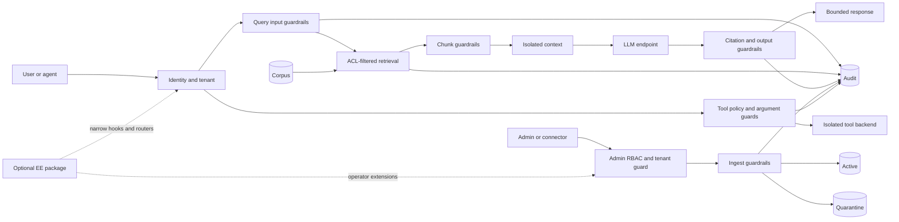

# RAG Protection Product Ownership Guide

| Field | Value |
|---|---|
| Audience | Incoming senior developer/architect; CE and licensed EE owners |
| Scope | End-to-end engineering, architecture, release, operations, and claims |
| Editions | Community Edition (CE) and optional Enterprise Edition (EE) |
| Status | Internal ownership handoff · July 2026 |
| Command root | Repository root unless a `cd` is shown |
| Sign-off | [Ownership Handoff Checklist](OWNERSHIP_HANDOFF_CHECKLIST.md) |

This is the master routing guide. It states boundaries, invariants, and decisions,
then links to the deep documents that own implementation detail.

## 1. Metadata and first-week outcome

By the end of week one, the owner must be able to:

1. start clean CE and prove EE is absent;
2. start CE+EE when the licensed package is available;
3. trace query, ingest, and tool requests from identity to audit;
4. explain SQLite and Qdrant ACL enforcement accurately;
5. identify the active policy file, including persisted Docker state;
6. classify a change as CE-internal, EE-internal, or seam;
7. run the matching validation workflow;
8. diagnose 404, 401, and 403 correctly;
9. explain paired release and rollback order; and
10. record evidence in the [handoff checklist](OWNERSHIP_HANDOFF_CHECKLIST.md).

First-week proof:

```bash
git status --short
bash tools/build_ce.sh --ci --typecheck --test
bash tools/workflow_validate_commit.sh ce
bash tools/docker_start.sh --smoke
curl -sf http://localhost:8090/health | python3 -m json.tool
bash tools/docker_stop.sh
```

Record commit SHA, tool versions, sanitized output, and exceptions. Never record
tokens, customer content, private source, or unredacted sensitive audit details.

## 2. Mission and non-goals

RAG Protection is a security gateway around retrieval-augmented generation and
agent/tool traffic. It resolves identity, enforces document ACLs, scans untrusted
input and retrieved content, controls generation and citations, scans output,
governs tools, and emits security-relevant audit evidence.

It is not:

- a LangChain, LlamaIndex, agent framework, vector database, or model replacement;
- a general document management system;
- a guarantee that every upstream corpus, model, connector, or IdP is safe;
- a certification, legal opinion, or automatic compliance verdict;
- a shipped HA control plane merely because Compose, Helm, or pgvector is used;
- permission to present Planned, Deferred, or unverified work as available.

Read [CE Architecture](../../ENTERPRISE.md),
[CE Design](../../ENTERPRISE.md), [EE Architecture](../../ENTERPRISE.md),
and [EE Design](../../ENTERPRISE.md).

## 3. Trust-boundary diagram



Tokens, tenant selectors, metadata, retrieved text, model output, connector
permissions, tool descriptions, and arguments are untrusted. UI visibility is not
authorization. Unauthorized text must not enter scored candidates or model context.
Blocked paths stop before downstream effects or LLM calls. EE may add controls but
must not weaken the CE floor.

## 4. Two repositories, two packages, one additive product

```text
RAG_protection/                 CE repository
└── rag-protection-proxy/       package: rag-protection-proxy

rag-protection-enterprise/      private EE repository and package
```

Directory prefixes for docs, scripts, and deploy (so the trees can split without mixed files): [edition/README.md](../ce/README.md). New CE/EE/shared files go under `docs/{ce,ee,shared}/` and `tools/{ce,ee,shared}/`.

For paired local development, EE is commonly checked out at
`RAG_protection/rag-protection-enterprise/`, but remains a separate repository.
CE owns the trust paths and must run without an EE wheel, checkout, bundle, or
setting. EE loads optionally through `register_enterprise()` and `EnterpriseDeps`;
it extends CE rather than replacing it.

Status semantics:

- **404:** route/resource absent; expected for Tier 2/3 routes without EE.
- **401:** route exists, but authentication is missing or invalid.
- **403:** identity accepted, but role, tenant, or entitlement denied.

Do not add CE stubs for EE routes. Do not diagnose every 403 as licensing.
Read [EE Developer Guide](../../ENTERPRISE.md),
[endpoint tiering](../../ENTERPRISE.md), and
[plugin seams](../../ENTERPRISE.md).

## 5. Code ownership map

| Area | Location | Owner |
|---|---|---|
| App lifecycle and Tier 1 routes | `rag-protection-proxy/rag_protection_proxy/app.py` | CE |
| Query orchestration | `rag-protection-proxy/rag_protection_proxy/pipeline.py` | CE |
| User identity and ACL | `rag-protection-proxy/rag_protection_proxy/acl.py` | CE |
| Admin RBAC/tenant scope | `rag-protection-proxy/rag_protection_proxy/admin_auth.py` | CE |
| Configuration | `rag-protection-proxy/rag_protection_proxy/config.py` | CE |
| SQLite/hybrid/factory | `rag-protection-proxy/rag_protection_proxy/store.py` | CE |
| Qdrant/vector ACL | `rag-protection-proxy/rag_protection_proxy/vector_store.py` | CE |
| Tenant stores | `rag-protection-proxy/rag_protection_proxy/tenant_store.py` | CE |
| Scanners | `rag-protection-proxy/rag_protection_proxy/scanners/` | CE |
| Guardrail order | `rag-protection-proxy/rag_protection_proxy/guardrails/` | CE |
| Audit/integrity | `rag-protection-proxy/rag_protection_proxy/audit*.py` | CE |
| Tool gateway | `rag-protection-proxy/rag_protection_proxy/tools_gateway/` | CE |
| Shared console | `console/packages/core/` | CE/shared seam |
| Four CE workspaces | `console/packages/ce/` | CE |
| Registration/routes/hooks | `rag-protection-enterprise/rag_protection_enterprise/` | EE |
| EE UI | `rag-protection-enterprise/ee_ui/` | EE |
| Compatibility pin | `rag-protection-enterprise/CE_PIN` | EE release |

Use the detailed maps in [CE Developer Guide](../ce/guide/DEVELOPER_GUIDE.md) and
[EE Developer Guide](../../ENTERPRISE.md) before editing.

## 6. Critical invariants

1. SQLite rejects quarantined/unauthorized rows in application code before scoring.
2. Qdrant places the ACL metadata filter inside the vector search query.
3. Hybrid retrieval filters each leg before reciprocal-rank fusion.
4. CE has exactly five workspaces: Overview, Query Lab, Documents & Ingest, Tool Gateway, Audit Log (Documents is ingest/list/delete only).
5. CE DLP is regex, custom patterns, secrets/URL checks, and heuristic NER—not
   vendor semantic DLP or Presidio-grade detection.
6. Unknown connector permission mappings, tenant ambiguity, and invalid critical
   configuration fail closed; they never broaden access.
7. Blocked query, empty authorized retrieval, severe extraction, or all-blocked
   chunks terminate before generation.
8. CE quarantine is metadata list, delete, remediate, and re-ingest; preview and
   approve/reject are EE.
9. CE owns tool list/invoke and CHALLENGE runtime; EE #13 is registry CRUD/UI.
10. CE imports no private dependency on its default path.
11. Evidence Pack supports evidence collection; it is not certification,
    attestation, auditor opinion, or conformity assessment.
12. Audit, logs, errors, screenshots, bundles, and CI artifacts do not leak secrets.

```bash
bash tools/run_tests.sh -q \
  tests/test_rag_protection.py \
  tests/test_vector_store.py \
  tests/test_ce_ee_seams.py \
  tests/test_audit_integrity.py
```

## 7. Request lifecycles

### Query

```text
POST /v1/query → app auth/tenant → query scan → ACL-filtered retrieval
→ canary/extraction/chunk scans → isolated context + LLM route
→ citation/output guards → response + audit
```

Retrieval changes require SQLite/Qdrant parity. Early decisions require a no-LLM
test. Output changes require citation, redaction, and non-leaking audit tests.

### Ingest and quarantine

```text
POST /v1/ingest → bounded model → ingest_admin + tenant guard
→ ingest scan/risk → active or quarantine metadata → store → audit
```

```text
GET /v1/documents/quarantined
DELETE /v1/documents/{id}
POST /v1/ingest
```

Do not add CE body preview or approve-in-place. Connector ACL mapping fails closed
instead of assigning a broad fallback group.

### Tools

```text
POST /v1/tools/invoke → identity → policy/registry lookup
→ description/allowlist/schema/argument/input scans → ALLOW|CHALLENGE|BLOCK
→ backend only when allowed → audit
```

The CE workspace is policy/challenge oriented; API is the primary invoke surface.
A backend must not bypass `tools_gateway/router.py`.

## 8. Configuration hierarchy and runtime state

Clean sources:

```text
rag-protection-proxy/config/policy.yaml
rag-protection-proxy/config/acl_policy.yaml
rag-protection-proxy/config/tool_policy.yaml
```

Policy selection is:

1. `RAG_POLICY_WRITABLE_FILE`, when set;
2. writable `RAG_POLICY_FILE`;
3. otherwise `RAG_DATA_DIR/policy.yaml`.

Compose mounts config read-only and normally uses `/data/policy.yaml`. First start
seeds repository `data/policy.yaml`; later restarts use it. Editing the clean
`config/policy.yaml` does not override existing persisted `data/policy.yaml`.
Tool policy follows a parallel writable-copy rule.

```bash
curl -sS -X POST http://localhost:8090/admin/reload-policy \
  -H "Authorization: Bearer ${ADMIN_TOKEN}"
```

Always identify clean `config/` versus persisted `data/` state. Reload refreshes
policy, ACL, and tool policy; not every environment value is hot-reloaded.
Entitlements require process restart. Read [CE Admin](../../ENTERPRISE.md)
and [EE Admin](../../ENTERPRISE.md).

## 9. Local bootstrap

### CE-only

```bash
cd /path/to/RAG_protection
bash tools/setup_venv.sh
source .venv/bin/activate
python -m pip install -e ./rag-protection-proxy
cd console && npm ci && cd ..
bash tools/build_ce.sh --ci --typecheck --test
python - <<'PY'
import importlib.util
assert importlib.util.find_spec("rag_protection_enterprise") is None
print("CE-only environment confirmed")
PY
bash tools/run_tests.sh -q tests/test_ce_ee_seams.py
bash tools/docker_start.sh --smoke
```

Stop with `bash tools/docker_stop.sh`.

### CE plus licensed EE

```bash
cd /path/to/RAG_protection
python3 -m venv .venv
source .venv/bin/activate
bash tools/dev_install_ee.sh
bash tools/build_ce.sh
bash tools/build_ee.sh
export RAG_EE_ENTITLEMENTS=all   # local development only
bash tools/docker_start.sh --ee --smoke
python -c "from rag_protection_proxy.app import app; \
assert getattr(app.state, 'enterprise_registered', False)"
```

Use explicit entitlements in customer deployments. If EE is unavailable locally,
say **private-EE verified**, not locally source-proven.

## 10. Change workflow decision tree

```text
Does it alter a CE contract consumed by EE?
├─ yes → SEAM
│  EnterpriseDeps, app.state hook, shared route/model, auth/tenant/audit/policy
│  contract, store factory, or EE UI bootstrap
└─ no
   ├─ private EE implementation only → EE-INTERNAL
   └─ CE implementation, CE remains standalone → CE-INTERNAL
```

```bash
bash tools/workflow_validate_commit.sh ce --help
bash tools/workflow_validate_commit.sh ee --help
bash tools/workflow_validate_commit.sh seam --help

bash tools/workflow_validate_commit.sh ce
bash tools/workflow_validate_commit.sh ee
bash tools/workflow_validate_commit.sh seam <approved options>
```

`ce` leaves `CE_PIN` alone. `ee` validates EE against its current pin. `seam`
coordinates both sides. Validation does not authorize commit, tag, publish, or
deploy. Read [Dev Workflow Quick](../ce/README.md).

## 11. Testing pyramid

1. scanner/model/component unit tests;
2. focused pipeline/store/route tests with denial cases;
3. in-process integration and backend parity;
4. CE/EE seam and private EE integration;
5. console typecheck/test/build;
6. Compose/live smoke;
7. aggregate labs/readiness validation when claims change.

```bash
bash tools/run_tests.sh -q tests/test_<area>.py
bash tools/run_tests.sh -q -m "not live"
bash tools/run_tests.sh -q -m "integration and not live"
bash tools/run_tests.sh -q tests/test_ce_ee_seams.py
cd console && npm ci && npm run typecheck && npm run test && npm run build && cd ..
bash tools/validate_labs.sh
bash tools/docker_start.sh --smoke
bash tools/smoke_rag_proxy.sh
bash tools/docker_stop.sh
```

Security changes need happy, unauthenticated, unauthorized, cross-tenant, malformed,
threshold, disabled, audit, persistence, backend parity, and CE-without-EE cases as
applicable.

## 12. CI/CD and paired releases

CE CI runs without EE and owns proxy tests, console, live Compose, security scans,
and path-filtered tools. EE CI reads `CE_PIN`, checks out that immutable CE tag,
installs CE then EE, and runs private backend/UI tests.

```text
CE release: vX.Y.Z-ce
EE release: vX.Y.Z-ee
EE CE_PIN: exact vX.Y.Z-ce
```

Seam promotion:

1. merge and validate CE;
2. create immutable `vX.Y.Z-ce`;
3. update EE `CE_PIN` to it;
4. validate and merge EE against the pin;
5. create matching `vX.Y.Z-ee`;
6. clean-room smoke the paired artifact.

Never release against a branch, dev label, sibling working tree, or untagged CE SHA.
Publishing is deliberate, not an automatic CI result. Read
[CI/CD](../ce/README.md) and
[EE Customer Delivery](../../ENTERPRISE.md).

## 13. Operations: observe, deploy, upgrade, roll back

```bash
curl -sf http://localhost:8090/health | python3 -m json.tool
curl -sf http://localhost:8090/metrics
curl -sS "http://localhost:8090/admin/audit/events?limit=20" \
  -H "Authorization: Bearer ${ADMIN_TOKEN}"
curl -sS http://localhost:8090/admin/audit/integrity/verify \
  -H "Authorization: Bearer ${ADMIN_TOKEN}"
docker compose ps
docker compose logs rag-protection-proxy
```

Compose is the local/pilot baseline. Helm is a deployment artifact, not HA proof.
Before upgrade, record immutable versions/config, back up policy/audit/store state,
test migrations and rollback, deploy, await health, then run ACL denial, query,
integrity, and smoke. Stop on identity, ACL, guardrail, audit, or seam regression.

Rollback preserves evidence, restores the previous immutable pair and supported
configuration, avoids untested destructive data rollback, reruns health/smoke/ACL/
integrity, and accounts for writes made by the failed version.

Use [CE Admin](../../ENTERPRISE.md), [EE Admin](../../ENTERPRISE.md),
and [Compose Overlays](../../ENTERPRISE.md).

## 14. Security operations

Alert meanings, triage, audit export, escalation, canary response, and exfiltration
correlation belong to the [SOC Runbook](../SOC_RUNBOOK.md).

Engineering preserves stable event kinds, bounded fields, integrity behavior, SIEM
schema documentation, and secret-safe telemetry. For cross-tenant exposure, canary,
compromised artifact, or audit gap: stop promotion, preserve evidence, engage
Security/IR, and follow the runbook. Do not destructively “clean up” evidence.

## 15. Ship a feature end to end

1. Define outcome, threat, edition, tier, maturity, and non-goals.
2. Select CE, EE, or seam before implementation.
3. Identify auth, tenant, ACL, entitlement, persistence, and audit effects.
4. Change the smallest owner; keep CE independent and EE additive.
5. Add positive and negative tests.
6. Run focused tests, workflow, seam checks, and smoke.
7. Update technical catalog: [CE](../../ENTERPRISE.md) or
   [EE](../../ENTERPRISE.md).
8. Update business catalog: [CE](../../ENTERPRISE.md) or
   [EE](../../ENTERPRISE.md).
9. Update architecture/design, functional spec, role guides, demos, and release notes
   where their contract changes.
10. Reconcile status with [Capability Readiness](../../ENTERPRISE.md).
11. Review validation, rollout, rollback, and claim boundaries.
12. Release in edition order and verify health, denial, audit, and behavior.

Done means code, denial behavior, deployment, rollback, catalogs, readiness, and
claims describe the same tested reality.

## 16. Documentation authority matrix

| Question | Authority |
|---|---|
| What executes now? | Runtime source and focused tests |
| Is CE independent/route registered? | Seam tests, OpenAPI, plugin seams |
| CE/EE boundary? | Endpoint tiering and plugin-seam docs |
| UI loading? | Console architecture and source/tests |
| Required behavior? | Edition functional specification |
| Design rationale? | Edition architecture/design |
| Deploy/configure? | Edition admin guide/runbook |
| Tutorial/validation? | Technical feature catalog |
| Business value / how to try? | Feature tutorials (`ce/learn/`, `ee/learn/`) |
| Maturity? | Capability Readiness plus catalog evidence |
| Build/pin/promote? | CI/CD and build/run/debug |
| Alert response? | SOC Runbook |
| Transfer ownership? | This guide and handoff checklist |

Runtime evidence beats a stale summary; correct every affected presentation layer.
A passing test alone does not authorize a stronger commercial/compliance claim.

## 17. Known debt and claim-safe boundaries

- Drive live is shipped; Notion is fixture/evaluation only.
- SharePoint, Confluence, Jira, and additional live connectors are Planned.
- SCIM is Partial read-only group merge, not write-back provisioning.
- Multi-replica HA/shared rate-limit coordination are not established.
- pgvector is EE/customer-supplied; it does not imply managed Postgres or HA.
- Presidio/spaCy NER, NLI, reputation, and trained injection classifiers are Planned.
- ReBAC, purpose access, token vault, and BYOK are Planned.
- Embedding-space poisoning detection is Deferred.
- SOC 2 Type II is not established by generating evidence.
- Packs/baselines are starting points, not compliant deployments.
- If local EE is absent, use **private-EE verified**, not locally verified.

Use [Feature Catalog Index](FEATURE_CATALOG_INDEX.md) maturity vocabulary. Never
present Planned controls in live navigation or successful examples as available.

## 18. Ownership cadence and 30/60/90

Weekly: review required checks, alerts, flaky tests, incidents, seam changes,
`CE_PIN`, claim drift, and exceptions.

Monthly: rehearse restore/rollback; review access, secret rotation, retention,
provenance, catalogs/readiness, architecture debt, and invariants.

Day 30:

- operate CE independently through change, CI, smoke, diagnosis, and rollback;
- close critical access gaps and complete architecture teach-back.

Day 60:

- lead a seam release or non-publishing paired promotion rehearsal;
- lead an incident tabletop; demonstrate EE or record approved access limitations.

Day 90:

- ship a production-representative change with threat, tests, docs, release,
  rollback, and post-deploy evidence;
- re-baseline debt, test health, risks, claims, and ownership;
- obtain Product/Security sign-off through the
  [handoff checklist](OWNERSHIP_HANDOFF_CHECKLIST.md).

## 19. Quick reference and reading list

```bash
git status --short
git diff --check
bash tools/build_ce.sh --ci --typecheck --test
bash tools/workflow_validate_commit.sh ce
bash tools/workflow_validate_commit.sh ee --help
bash tools/workflow_validate_commit.sh seam --help
bash tools/rag-scan check --env prod \
  --acl rag-protection-proxy/config/acl_policy.prod.yaml --severity critical
bash tools/validate_labs.sh
bash tools/docker_start.sh --smoke
curl -sf http://localhost:8090/health
bash tools/docker_stop.sh
```

Required:

1. [Ownership Handoff Checklist](OWNERSHIP_HANDOFF_CHECKLIST.md)
2. [Community Developer Guide](../ce/guide/DEVELOPER_GUIDE.md)
3. [Enterprise Developer Guide](../../ENTERPRISE.md)
4. [Feature Catalog Index](FEATURE_CATALOG_INDEX.md)
5. [CE technical catalog](../../ENTERPRISE.md)
6. [EE technical catalog](../../ENTERPRISE.md)
7. [CE learn README](../ce/learn/README.md)
8. [EE learn README](../../ENTERPRISE.md)
9. [Edition package README](README.md)
10. [CI/CD](../ce/README.md)
11. [SOC Runbook](../SOC_RUNBOOK.md)

By task:

- Architecture: [CE](../../ENTERPRISE.md) · [EE](../../ENTERPRISE.md)
- Requirements: [CE](../../ENTERPRISE.md) ·
  [EE](../../ENTERPRISE.md)
- Operations: [CE](../../ENTERPRISE.md) · [EE](../../ENTERPRISE.md)
- User/demo: [CE user](../../ENTERPRISE.md) · [CE demo](../../ENTERPRISE.md) ·
  [EE user](../../ENTERPRISE.md) · [EE demo](../../ENTERPRISE.md)
- Build/debug: [CE/EE Build Run Debug](../product/CE_EE_BUILD_RUN_DEBUG.md)
- Workflow: [Dev Workflow Quick](../ce/README.md)
- Claims: [Capability Readiness](../../ENTERPRISE.md)

The owner’s standard: know what runs, where trust is enforced, which edition owns
it, how to prove it, how to roll it back, and exactly what may be claimed.
